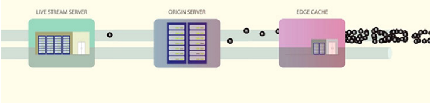

### 协议选择

最初选择HLS,后面切换为RTMP，切换为RTMP主要为了降低延迟，提供更好直播用户体验。


### 解决并发问题 

* 分发架构  
采用Live stream server， origin server， edge server 三层架构；如下图如示：


一句话通过遍布各地的CDN节点（edge server）实现海量用户的播放请求。

* 请求合并应对高并发 
采用的CDN方案，应对一般数量级的播放是没有问题，但是facebook上有很多名人与网红，他们每个人都有几百万个粉丝，这就要求facebook  live 直播系统能够处理超过一亿人同时播放的能力。假如一个名人的直播有100万粉丝同时观看，edge server缓存命中率为98%，那么未命中用户为2万，这2万用户回源到origin server甚至回源到Live stream server，服务器压力可想而知，这不是仅仅是2W连接，而是2W视频播放，带宽，cpu都是一个很大的考验。以带宽为例，用数字说话；
假设一个HLS切片为3S，高清视频码率为1800K bps，那么一秒带宽需求为：

```
20K /3 *1800K b/s * 1s =  20*600 Mb = 12 Gb
```


每秒的带宽超过10Gb，服务器网卡高配也才10Gb。

业务驱动方案，其具体解决方案如下：
在edge server 对同一个视频切片的多人cache  miss请求进行合并，只发送一个到 origin server，待origin server 返回该视频切片，同时发送给该视频切片的所有请求。这样就可以大量减少回源的请求数量。origin server亦是如此。

想到一个问题：
>最近520，林心如与霍建华在微博宣布恋爱关系，微博是怎么搞定推送信息众粉丝的呢？


### 实现RTMP
选择基于nginx rtmp改造，并开发rtmp proxy，采用nginx rtmp有如下好处：
1. nginx拥有一个良好的技术生态 
2. nginx的多进程模型能够充分分挥多核cpu的能力
3. nginx rtmp已经有大量的应用，基本功能可靠
4. nginx rtmp基于c语言实现，有良好的性能，当有大量的节点部署的情况下，可以省一大批服务器，能够节省一大笔成本 


### 参考 
1. [Under the hood: Broadcasting live video to millions](https://code.facebook.com/posts/1653074404941839/under-the-hood-broadcasting-live-video-to-millions/) 