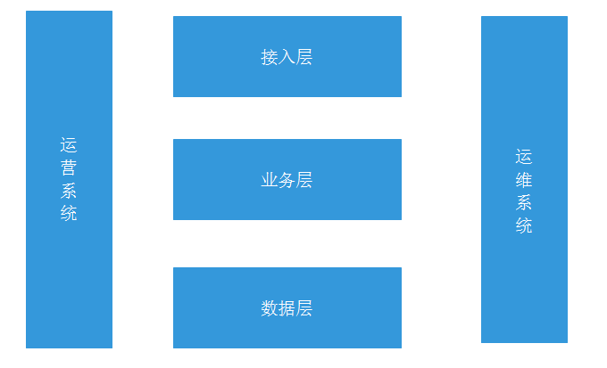
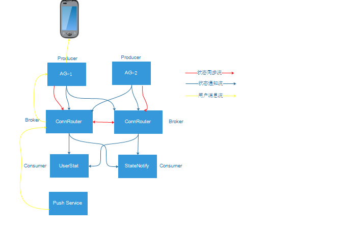

---
layout: post
title: IM后端系统设计总结(2)
categories: 架构设计
tags: 架构设计
--- 

这篇具体写一下用户在线状态系统的具体设计。

## 后端架构  

这个后端系统设计如下图：

很大众，国内基本都这么干，不多说

## 用户状态系统设计

### 初期设计 

单IDC部署，设计如下: 

#### 相关说明
1. AG：接入网关，负责用户的连接
2. ConnRouter：连接路由服务器，主要提供以下功能：
* 所有用户状态的维护 
* 用户状态查询
* 用户状态推送
* 用户状态同步
* 异步消息路由与转发
3. 状态通知流: 用户登录成功或者下线状态通知 
4. 状态同步流：ConnRouter服务器之间用户状态的同步，不需要推送给订阅者  
5. 用户消息流: 异步发送给用户的消息在服务器内部的传输 

#### 设计要点 

1. 参考Kafka的模型，将用户状态改变作为事件，将事件描述为消息，将消息队列化成消息队列 
2. AG对应Kafka中的Producer角色，主要原因是**用户状态是用户连接的影子**，AG能真实快速感知用户状态 
3. ConnRouter对应Kafka中的Broker 
4. UserStat（用户统计与分析）与StateNotify（用户状态通知）对应Kafka中的Consumer
5. 减少耦合，以异步发送消息到用户为例，整个流程三步走：
* 第一步：生成发送消息，发送到ConnRouter  
* 第二步：根据目的用户ID，查找到出口AG，将消息转发到出口AG 
* 第三步：出口AG查找用户连接，通过连接发送到目的用户  

#### ConnRouter设计 

##### 用户状态数据存储设计

用户状态数据存储设计，如下图所示：

1. 内存消耗 
主要内存消耗来自用户状态数组（与ConnRouter连接都是长连接，可以忽略不计）
每种客户端类型下每个用户占用一个1Byte，那么1G内存可以存1073741824个用户的状态，超过了10亿，支持亿级用户内存不是瓶颈  

2. 查找用户所在AG与状态O(1)   

##### 高可用性 

1. 服务器级Master-Master模式 
2. 根据用户ID选择ConnRouter Master实现用户级Master-Standby模式 

##### 高性能

1. epoll事件驱动  
2. 无锁数据访问
3. 流程无阻塞 
4. O(1)查找 
5. 多核并发  
6. 支持批量处理 

##### 支持Failover，方便升级

1. 当ConnRouter宕机或者主动升级重启时，各AG重新建立连接时，将自身的用户状态同步到ConnRouter，完成用户状态数据恢复 

##### 无状态与单点自治 

1. ConnRouter用户状态数据是各个AG的同步，真正用户状态保存在AG网关
2. 单点可以独立工作 

##### 数据冲突处理

主要是一个数据优先级的原则（根据数据源，从高到低）：

1. 状态数据来自AG 
2. 状态数据来自ConnRouter-Master  
3. 状态数据来自ConnRouter-Standby
4. 状态数据来自RouterProxy 

### 支持多IDC

保证更高可用性，需要支持多机房部署，在现在这个异地多活不断出现在眼前情况，考虑一下支持多IDC的设计，具体设计如下图：

这里主要是引入了RouterProxy，将跨IDC ConnRouter连接起来，其中RouterProxy主要功能如下：

1. 作为Producer同步状态通知到其他IDC RouterProxy
2. 作为Comsumer接收同步状态发布到本IDC的ConnRouter  
3. 作为IDC间消息转发的网关 

### ConnRouter扩展 

随着用户量增长，ConnRouter转发消息量，状态通知量，消息转发量都会不断增长，当然可以简单采用更好机器来scale up;下面是考虑进行业务拆分方式进行scale out，具体设计如下图：

从上图可知主要方案：
1. 将异步消息转发业务拆分出来由Forward服务器来完成 
2. 将RouterProxy跨IDC消息转发业务拆分出来，由ForwardProxy服务器来完成

### 不足 

1. 需要优化跨IDC间消息同步与转发流量 
2. 在大量用户且系统中存在多个状态维护服务器，这样会有大量的状态同步通信，服务器的网络与CPU易成为瓶颈 

## 后记

方案可以有很多种，觉得引入直接引入Kafka是一个很好的选择，以后再研究。

由于个人水平有限，有什么不足与错误，敬请指正！