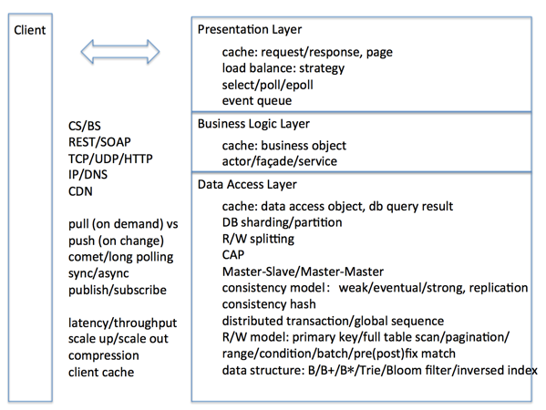

---
layout: post
title:  对于系统设计的一些想法 
categories:  系统设计
tags:  架构
--- 

### 前言  

学习了google，facebook等国际一流大厂的开源方案，也研究了国内BAT的一些设计案例，在平时工作自然也少不了一些系统设计的工作，想写一些自己的想法，同时也帮助自己梳理一下思路，实现自己的系统设计的套路。 

其实就是这一句话：**立足需求与业务，利用工程与技术，得到最合适的tradeofff，追求更简单的设计与方案，以此不断推进系统的演化**。

下面对这句话展开说明（当然，下面是一堆费话，只是为了解决自己的不吐不快而已罢了）。 

### 立足需求与业务

套用一句话：一切脱离需求的设计都是耍流氓。这里不进行具体案例分析，主要从以下角度来细化需求，提供思考的方向。

#### 用户角度  

1. performance（性能）  
2. availability（可用性）
3. usability（易用性）
4. security（安全性）

#### 研发角度 

1. maintainablity （可维护性性）
2. protability（可移植性）
3. reusability（可重用性）
4. scalable(可扩展性)
5. testability（可测试性） 

#### 商业与市场角度

1. time to market（及时发布推向市场）
2. cost and benifits（成本和收益）
3. projected life time （产品生命周期）
4. targeted market（目标市场）
5. integration with legacy system (系统集成)
6. roll back schedule （回退时间表）

### KISS(Keep It Simple, Stupid)

有太多的例子，说明追求简单与遵循简单的设计原则的重要性，最典型就是unix的设计哲学成就伟大的linux的操作系统。 

什么是简单的系统设计呢？
这是需要不断思考的问题，举个例子说明吧；在GFS实现中，针对client向chunk server写文件失败的问题，GFS的作法是直接返回失败，由client决定是否重写，这种作法就是聪明的简单之举。

简单并不是随手可得的。关于这个可以参考rob pike，golang发明人之一的这篇演进：
[Simplicity is Complicated](https://www.youtube.com/watch?v=rFejpH_tAHM)

下面借此说明以下几个问题？

1. 什么是简单？

简单很难定义，还是举例说明吧
追求简单并不是单纯追求技术实现上的简单。简单追求是使用的简单，因为使用是高频，实现可能只有几次，例如上面演进谈到的GC,实现并不简单，想出这个GC算法就相当困难，实现那就更难了，但是有了GC，我们用golang编程的时候就不需要像C/C++那样关心内存的申请释放，再也不用担心踩内存的问题了，专心于设计与业务，给程序员带来了简单。（以我自己为例，学会了golang，我写代码都写得多，之前只会C/C++时候，业余时间主要是阅读代码，写代码都是工作驱动）

另外还有一点，简单是先实现，再改进，例如golang的GC算法一开始并不好，GC导致应用
延迟大，到了1.5才有改进

2. 如何实现简单？

演进中const同c语言定义一个常量不一样，不需要关心类型，在生活中一般人说数字2017除了程序员谁关心它是整型数还是浮点数啊 

3. 如何判断设计是否简单呢？

让普通人也能容易理解与使用。

在生活中能够找到对应参考。

能够简单描述问题。

给人一种刚刚好感觉，不多不少。

还有更多。。。 

### Everything is tradeoff 

>理想很丰满，但是现实很骨感

>硬币总是两面的

在系统设计过程中我们总会遇到下面的问题：

1. 分布式场景下CAP只能三选二 
2. Push vs Pull 
3. Latency vs Throughput 
4. 速度 vs 成本 vs 质量 
5. SSD vs Disk
6. SQL vs NoSQL
7. Sharding vs Partitioning
8. Scale Up vs Scale Out  
9. Performance vs Scalability
10. ... 

**如果系统设计过程不知道系统优缺点，那表示你无法掌握这个系统设计**；相反如果深入理解每一个具体方案的优缺点，就可以SWOT原则作出判断与选择，而不是面对选择总是有那么多犹豫不决，而是一种感觉：在这种需求和条件，这样的选择是最合适的。 

### 工程与技术能力是基础 

需要掌握技术，立足需求，协调不断变化需求与技术实现的矛盾。
技术方案实现的实现需要软件工程的指导，保证整个这个方案落地过程中保持顺畅与有序进行。 

对于一个工作多年的程序员来说，从技术上就是要构建自己的知识体系，这里引用一张图如下：
 

这张图从网络请求处理时序的角度概括系统设计过程中可能涉及的技术点。

关于软件工程能力，在这里不多讲了，更多请参考微软邹欣老师的大作《构建之法》。

### 后记

人生贵在行动，迟疑不决时，不妨先迈出小小一步，若是美好，叫做精彩；若是糟糕，叫做经历！

写了一篇水货文章，方向大了，内容空洞，只能待以后将其拧干了。

（to be continued）

### 参考  

1. [Simplicity is Complicated](https://www.youtube.com/watch?v=rFejpH_tAHM)  
2. [system design primer](https://github.com/donnemartin/system-design-primer)
3. [系统设计的典型分层和涉及的知识点](http://www.raychase.net/3165)

