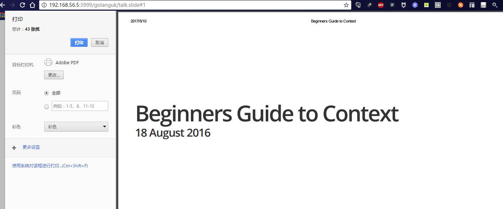

---
layout: post
title:  使用golang present制作slide 
categories:  tools
tags:  tools 
--- 


### 依赖

1. 依赖golang的开发环境 


### 安装 

present工具在golang.org/x/tools中，依赖golang.org/x/net包,安装过程如下： 

```
root@ia-VirtualBox:~#  go get golang.org/x/net 
root@ia-VirtualBox:~#  go get golang.org/x/tools
root@ia-VirtualBox:~#  go install golang.org/x/tools/cmd/present 
```

安装结束后查看present位置

```
root@ia-VirtualBox:~# which present
/usr/local/go/bin/present
```


### slide文件语法 

具体参考[准官方文档](https://godoc.org/golang.org/x/tools/present)


### 生成slide 

```
root@ia-VirtualBox:/share/gocode/src/github.com/pcrawfor# present  golanguk/talk.slide  
2017/05/09 23:53:15 Open your web browser and visit http://127.0.0.1:3999
2017/05/09 23:57:19 accepting connection from: 127.0.0.1:50852
```


### 共享slide 

```
root@ia-VirtualBox:/share/gocode/src/github.com/pcrawfor# present -http="192.168.56.5:3999"  golanguk/talk.slide    
2017/05/10 00:02:47 
WARNING!  WARNING!  WARNING!

The present server appears to be listening on an address that is not localhost.
Anyone with access to this address and port will have access to this machine as
the user running present.

To avoid this message, listen on localhost or run with -play=false.

If you don't understand this message, hit Control-C to terminate this process.

WARNING!  WARNING!  WARNING!
2017/05/10 00:02:47 Open your web browser and visit http://192.168.56.5:3999
```

### 生成PDF 

以chrome为例，步骤如下：

1. 按ctrl + p进入打印界面 


2. 选择打印方式为adode pdf，点击打印，即可保存为pdf 


(end)


