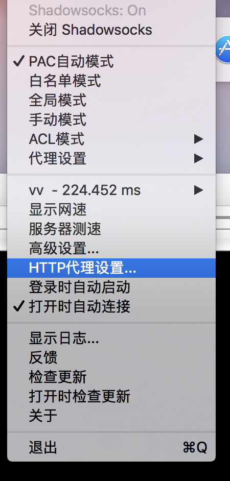
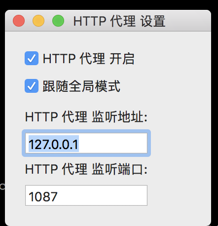

---
layout: post
title:   MacOS上设置终端代理  
categories:  Network
tags:  Network 
--- 

由于20-1大的原因，各种梯子损失惨重。自己也只好自己动手搭建VPS。关于如何搭建梯子这里暂不描述。

# 说明  

下面的操作是建立在成功搭建VPS基础上 


# 步骤 


## 查看代理端口  

代理客户端使用Shadowsocks-NG-R8,它解决了一个长久以来的痛点，Shadowsocks没有HTTP代理，导致需要使用polipo等软件进行协议转换。

## 第一步：选择HTTP代理设置




## 第二步：点击查看




## 设置代理命令

### vim打开`vim ~/.bash_profile`

### 在尾部添加如下内容： 

```
alias proxy-on='export http_proxy=127.0.0.1:1087;export https_proxy=$http_proxy'
alias proxy-off='unset http_proxy;unset https_proxy'
```

### 修改立即生效: `source ~/.bash_profile`


## 测试 


```
Michaels-iMac:~ eric$ proxy-on 
Michaels-iMac:~ eric$ go get -u google.golang.org/grpc   
package golang.org/x/net/context: golang.org/x/net is a custom import path for https://go.googlesource.com/net, but /Users/eric/go/src/golang.org/x/net is checked out from https://github.com/golang/net
package golang.org/x/net/http2: golang.org/x/net is a custom import path for https://go.googlesource.com/net, but /Users/eric/go/src/golang.org/x/net is checked out from https://github.com/golang/net
package golang.org/x/net/trace: golang.org/x/net is a custom import path for https://go.googlesource.com/net, but /Users/eric/go/src/golang.org/x/net is checked out from https://github.com/golang/net
package golang.org/x/net/http2/hpack: golang.org/x/net is a custom import path for https://go.googlesource.com/net, but /Users/eric/go/src/golang.org/x/net is checked out from https://github.com/golang/net
```

(end)


